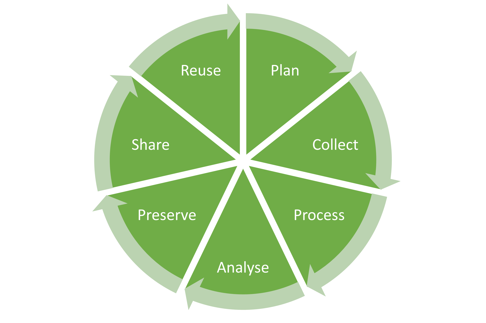

# Data Management for the Field Phentoyping Community

***Author:** Lars Grygosch ([**IGB-2**](https://www.fz-juelich.de/en/ibg/ibg-2) Forschungszentrum Juelich)\
**Contact:** l.grygosch@fz-juelich.de\
**Project-Background:** [**FAIRagro**](https://fairagro.net/) - Task Area 1 - [Use Case 5](https://fairagro.net/mitmachen/unsere-use-cases/use-case-5/)\
**Project URL:** https://github.com/gryvity/MIAFPE/tree/main/MIAFPE \
**Disclaimer:** This Project is a living Document and is meant to provide transperence of my ongoing work. Please feel free to reach out to me with your thoughts, critic or questions. Also be aware this project is still under developement, therefore is missing some content*

#### License    

[CC BY-SA 4.0](https://creativecommons.org/licenses/by-sa/4.0/)

---

The following Document is a collection of several concepts revolving around data, metadata and the management of data in order to enhance FAIR principles in the group of Field Phenotyping as bridging community utilizing data from Phenomics, Genomics, Environmetal Science and Remote Sensing. 

This tutorial is meant to be a first introduction to those who are starting with planning their data.

## Table of Content

- [Introduction](#introduction)              
   - [Motivation](#motivation)
   - [Field Phenotyping Data](#field-phenotyping-data)

- [Research Data Management](#research-data-management)

- [Data Life Cycle](#data-life-cycle)
   - [Planning](#planning)
   - [Collecting](#collecting)
   - [Processing](#processing)
   - [Analysing](#analysing)
   - [Preserving](#preserving)
   - [Sharing](#sharing)
   - [Reusing](#reusing)

- [Metadata](#metadata)
   - [What is Metadata](#what-is-metadata)
   - [Benefits of Metadata](#benefits-of-metadata)
   - [Metadata Standards](#metadata-standards)

- [Ontologies](#ontologies)

- [FAIR Principes](#fair-priciples)
   - [Findability](#findability)
   - [Accessibiltiy](#accessibility)
   - [Interoperability](#interoperability)
   - [Reusability](#reusability)

- [Best Practices](#best-practices)
   - [Data Publishing Mindset](#data-publishing-mindset)
   - [Documentation](#documentation)
   - [Structure](#structure)
   - [Name Space](#name-space)
   - [Raw Data](#raw-data)
   - [Provenance](#provenande)
   - [File Formats](#file-formats)
   - [Provide Metadata](#provide-metadata)
   - [Data Storage](#data-storage)
   - [Data Quality](#data-quality)
   - [License](#license)
   - [Sensitive Data](#sensitive-data)

- [Hands On](#hands-on)
   - COMING SOON

- [References](#references)

- [Glossar](#gloassar)
   - COMING SOON

---

## Introduction

### Motivation

The FAIR principles—Findable, Accessible, Interoperable, and Reusable—provide a framework for optimizing data management, sharing, and reusability in research. Proposed by Wilkinson et al. [[1](#1)], these principles address the core challenges faced in modern data-driven science, aiming to enhance the accessibility and long-term value of research data for a wide community of users. 

[not sure about that part:]
In the context of rapidly expanding domains like field phenotyping, FAIR data practices are essential for managing data generated at an unprecedented scale.

[insert more values that FAIR data could produce]

Despite the potential for data to drive innovation, much of the field phenotyping data remains difficult to find, access, or use effectively. Key issues include:
1. Data often remains unpublished or lacks open accessibility, limiting its potential for further analysis.
2. Metadata, which is critical for understanding datasets, is frequently missing or insufficient, impeding data interpretability and integration.
3. Poor data quality can render some datasets unusable, especially when collected under inconsistent protocols or without adequate quality controls.
4. Proprietary formats restrict access to certain datasets, as specific software or licenses are needed, which limits reusability across platforms and user groups.

A primary reason behind these issues is the lack of a strong data-sharing culture within research. Researchers may hesitate to share their data due to fears of losing a competitive edge, limited training in research data management (RDM), or insufficient incentives and recognition for sharing high-quality, well-documented data. Additionally, proprietary formats and tools, combined with the time and effort required for proper annotation and ontology use, further complicate data publication. Aligning on standards across interdisciplinary fields such as plant science and remote sensing adds another layer of complexity, as each domain often has its own established practices and terminologies.

This guide aims to support researchers in overcoming these challenges by providing actionable recommendations and best practices in data management. By following the FAIR principles, researchers can ensure that their data remains accessible, understandable, and valuable for future studies. Embracing FAIR practices ultimately extends the longevity and impact of research data, enhancing collaboration and cumulative knowledge-building across disciplines. This approach not only facilitates more efficient data discovery and integration but also fosters transparency and reproducibility—cornerstones of scientific progress. For researchers in field phenotyping, aligning with FAIR principles can open new avenues for interdisciplinary research, support sustainable agriculture, and contribute to a global data ecosystem essential for addressing complex biological and environmental questions.

### Field Phenotyping Data

The field phenotyping domain is especially impacted by this data explosion. Advances in plant monitoring technologies, integration with remote sensing platforms, and the rise of artificial intelligence (AI) techniques contribute to the high volume and complexity of data. For example, modern phenotyping setups increasingly utilize classical machine learning and deep learning, which drive new insights but also bring challenges in data handling, storage, and interoperability, especially with regard of creating metadata. Data diversity grows as field phenotyping intersects with genomics and other disciplines, making FAIR data practices vital for bridging these fields and enabling multi-disciplinary research.

---

## Research Data Management

---

## Data Life Cycle

[needs refinement]

In scientific research, managing data effectively across its entire life cycle is essential for maximizing its impact, usability, and longevity, as well as provide funders with a transparent strategy. The data life cycle represents a structured approach to organizing data from the initial planning stages through collection, processing, analysis, preservation, sharing, and eventual reuse. Each stage involves specific actions and decisions that affect data quality, accessibility, and long-term value, particularly in high-throughput and heterogeneous domains like field phenotyping, where data complexity is high and cross-study compatibility is vital.

Understanding and implementing best practices across these stages enables researchers to adhere to the FAIR (Findable, Accessible, Interoperable, and Reusable) principles, thereby enhancing the utility of their data for a broader scientific community. Each phase builds upon the previous one, creating a seamless flow that facilitates not only immediate research objectives but also future data integration, meta-analysis, and long-term accessibility.

### Planning

### Collecting

### Processing

### Analysing

### Preserving

### Sharing
### Reusing

---

## Metadata

### What is Metadata

### Benefits of Metadata

### Metadata Standards

---

## Ontologies

Task: Finding an Ontology for Metadata Annotation;

What is an Ontology

Best practices

---

## FAIR Principes

### Findability

### Accessibiltiy

### Interoperability

### Reusability

---

## Best Practices
### Data Publishing Mindset
### Documentation
### Structure
### Name Space
### Raw Data
### Provenance
### File Formats
### Provide Metadata
### Data Storage
### Data Quality
### License !!!
### Sensitive Data

---

## Hands On

**COMING SOON**

---

## References

<a id="1">[1]</a>
Wilkinson, M., Dumontier, M., Aalbersberg, I. et al. The FAIR Guiding Principles for scientific data management and stewardship. Sci Data 3, 160018 (2016). https://doi.org/10.1038/sdata.2016.18

<a id="2">[1]</a> 
Machwitz M, Pieruschka R, Berger K, Schlerf M, Aasen H, Fahrner S, Jiménez-Berni J, Baret F and Rascher U; 2021;  Bridging the Gap Between Remote Sensing and Plant Phenotyping—Challenges and Opportunities for the Next Generation of Sustainable Agriculture; Front. Plant Sci.; 12:749374.; doi: 10.3389/fpls.2021.749374

---

## Glossar

**COMING SOON**

